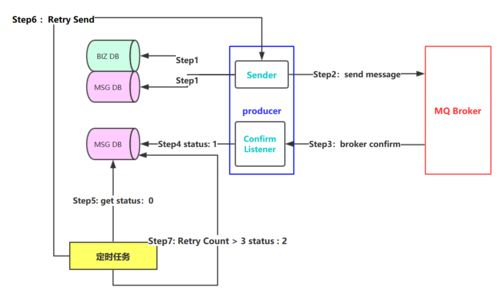

## 整体方案流程图


## 数据库文件
```sql
-- ----------------------------
-- Table structure for broker_message_log
-- ----------------------------
DROP TABLE IF EXISTS `broker_message_log`;
CREATE TABLE `broker_message_log` (
  `message_id` varchar(255) NOT NULL COMMENT '消息唯一ID',
  `message` varchar(4000) NOT NULL COMMENT '消息内容',
  `try_count` int(4) DEFAULT '0' COMMENT '重试次数',
  `status` varchar(10) DEFAULT '' COMMENT '消息投递状态 0投递中，1投递成功，2投递失败',
  `next_retry` timestamp NOT NULL DEFAULT '0000-00-00 00:00:00' ON UPDATE CURRENT_TIMESTAMP COMMENT '下一次重试时间',
  `create_time` timestamp NOT NULL DEFAULT '0000-00-00 00:00:00' ON UPDATE CURRENT_TIMESTAMP,
  `update_time` timestamp NOT NULL DEFAULT '0000-00-00 00:00:00' ON UPDATE CURRENT_TIMESTAMP,
  PRIMARY KEY (`message_id`)
) ENGINE=InnoDB DEFAULT CHARSET=utf8;

-- ----------------------------
-- Table structure for t_order
-- ----------------------------
DROP TABLE IF EXISTS `t_order`;
CREATE TABLE `t_order` (
  `id` int(11) NOT NULL AUTO_INCREMENT,
  `name` varchar(255) DEFAULT NULL,
  `message_id` varchar(255) DEFAULT NULL,
  PRIMARY KEY (`id`)
) ENGINE=InnoDB AUTO_INCREMENT=2018091102 DEFAULT CHARSET=utf8;
```

## 完整实例代码[spring-boot-rabbitmq-availability](https://github.com/sanliangitch/spring-boot-demo/tree/master-wulang/spring-boot-rabbitmq-availability)

## 演示步骤:
1. 修改配置文件中的rabbitmq配置和数据库配置
2. run ConsumerApplication 来开启消费者服务
3. run ProducerApplication 来开启生产者服务
4. run SpringbootProducerApplicationTests 中的testSend方法来发送消息进行测试
## 代码实例及学习参考内容来自慕课网课程[RabbitMQ消息中间件极速入门与实战](https://www.imooc.com/learn/1042)

## 提示：
**本示例仅针对，并发量不是很大的系统可以做到参考作用，若并发量很大，频繁扫描表，也会带来性能瓶颈。** <br/>
